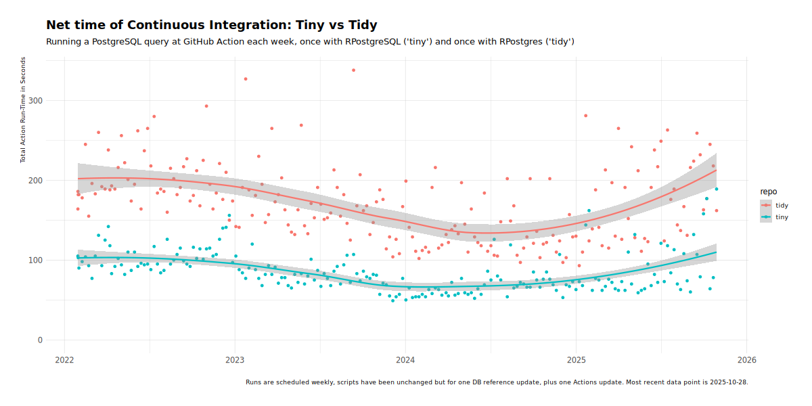

## less is more -- tiny versus tidy

The repositories [lim-tiny](https://github.com/eddelbuettel/lim-tiny) and
[lim-tidy](https://github.com/eddelbuettel/lim-tidy) each execute one task of
querying a remote PostgreSQL database on a weekly schedule driven by GitHub
Actions.  A [blog
post](https://dirk.eddelbuettel.com/blog/2023/01/30/#039_faster_feedback_system_tiny_vs_tidy_example)
summarises the set up and provides additional context.

This repository collects the runtimes of the _tiny_ and _tidy_ attempts and
plots them. The following charts visualizes the result.

